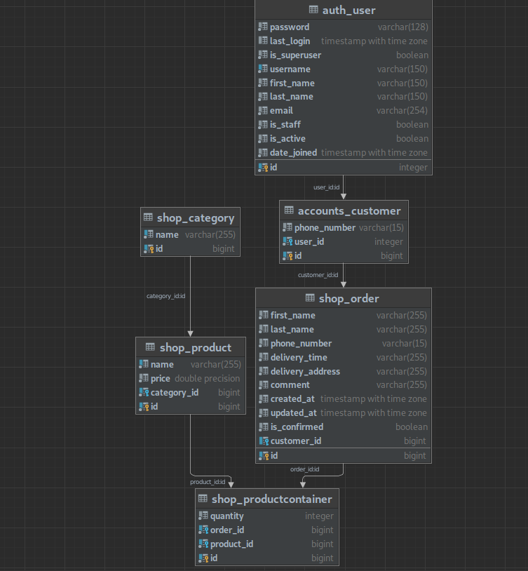
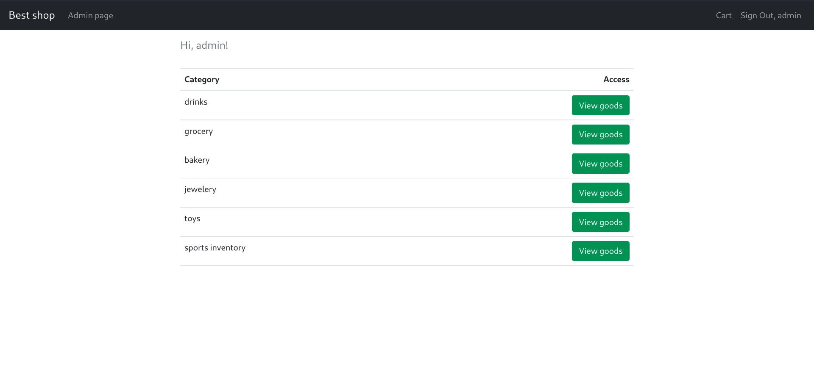
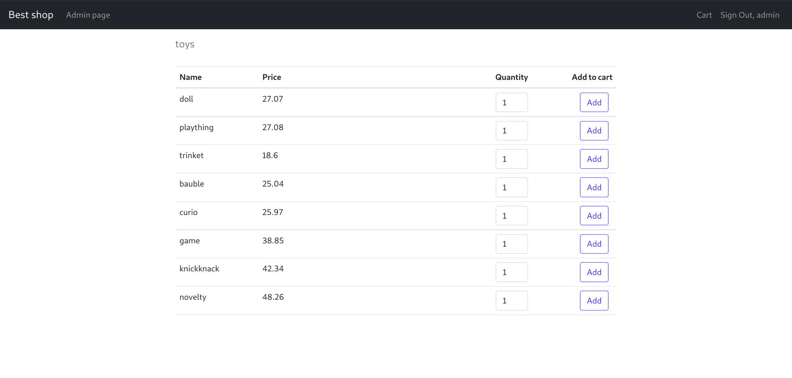
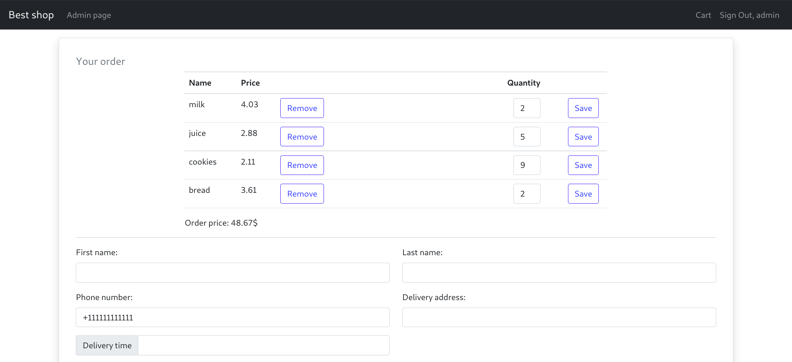
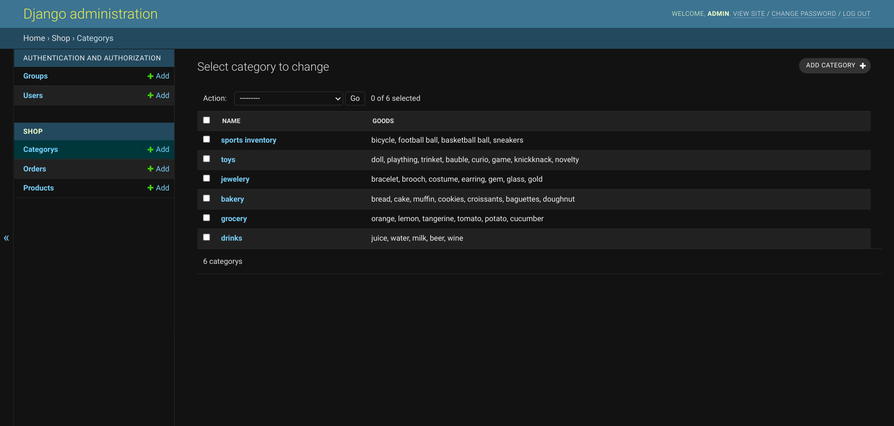
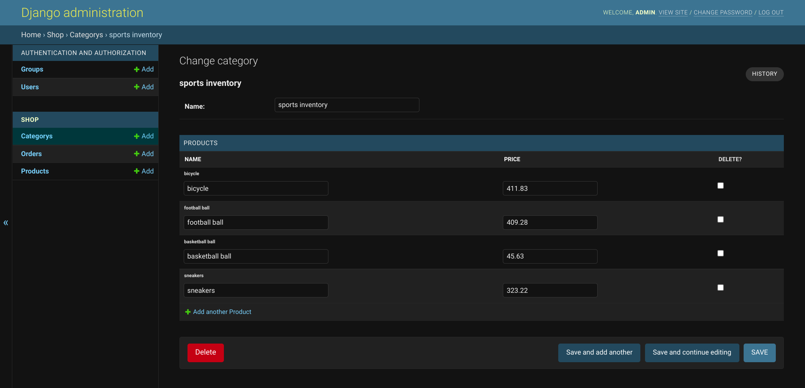

# Shop
Projekt jest witryną sklepu internetowego z możliwością składania zamówień i przechowywania wyników w bazie danych. 
Projekt jest realizowany przy użyciu frameworka Django.

## Stosowane technologie
Za podstawę posłużyły Python 3.8 i Django 3.2. Jako bazę danych wybrano PostgreSQL. 
Jako technologię wspierającą układ graficzny wykorzystano Bootstrap. Kontrolę wersji projektu przeprowadzono za pomocą programu Git.

## Instalacja i konfiguracja projektu
Nie trzeba tego umieszczać w dokumentacji końcowej, ale z mojego doświadczenia wynika, że tak właśnie jest, 
prawie każda dokumentacja oprogramowania zawiera instrukcje instalacji
### Przygotowanie
Przed rozpoczęciem konfiguracji projektu należy zainstalować 
python 3 oraz postgreSQL. W bazie danych postgreSQL należy również utworzyć bazę danych o nazwie `shop`.

### Konfiguracja projektu
1. Sklonuj repozytorium z kodem
```
git clone https://github.com/Poludzen/InternetShopProject.git
```
2. Utwórz wirtualne środowisko Pythona (wewnątrz folderu repozytorium)
```
python -m venv venv
```
3. aktywacja środowiska wirtualnego (Linux)
```
source venv/bin/activate
```
4. Instalowanie wymaganych zależności projektu
```
pip install -r requirements.txt
```
5. Stosowanie migracji bazy danych (tworzenie tabel)
```
python manage.py migrate
```
6. Wypełnianie bazy danych danymi testowymi
```
python manage.py create_default_data
```
Spowoduje to utworzenie superużytkownika `admin` z hasłem `pass1234`, 
a także artykuły do sklepu.

7. Uruchom projekt na swoim komputerze
```
python manage.py runserver localhost:8000
```
Po wykonaniu tych procedur strona internetowa powinna pojawić się w przeglądarce pod adresem `https://localhost:8000`.


## Funkcjonalność
* Wybierz produkty i dodaj je do koszyka
# Wybierz ilość sztuk
* Obliczanie wartości zamówienia na podstawie liczby elementów
* Panel administracyjny z możliwością edycji danych o produktach, kategoriach, zamówieniach i użytkownikach
* Logowanie i rejestracja użytkownika


## Opis rozwiązania

### Architektura bazy danych
Oprócz standardowych tabel Django utworzono 5 dodatkowych tabel. 
Tabele i relacje między nimi pokazano na poniższym zrzucie ekranu.




### Struktura projektu
Projekt składa się z dwóch aplikacji: `konta` i `sklep`. Każdy z nich to folder, który zawiera 
są zlokalizowane:
* modele dla bazy danych (`models.py`)
* Logika obsługi żądań użytkowników (`views.py`) 
* Formularze (`forms.py`)
* lista używanych adresów url (`urls.py`)
* Folder `templates` z szablonami stron html.
* kilka innych plików pomocniczych

Szablony html zostały napisane przy użyciu języka szablonów Django Template Language, który pozwala na dynamiczną zmianę szablonów w zależności od 
w zależności od danych. Układ i style zostały zaimplementowane przy użyciu Bootstrap. Aby uniknąć powielania kodu w niektórych
zastosowano dziedziczenie szablonów.

W folderze `src` znajduje się plik z podstawowymi ustawieniami projektu (`settings.py`), oraz inne niezbędne do uruchomienia
strona internetowa.

Skrypt `manage.py` jest odpowiedzialny za uruchomienie projektu, a zależności od projektu są przechowywane w pliku `requirements.txt`.

### Wynik
Na stronie głównej sklepu będą wyświetlane wszystkie kategorie produktów


Za pomocą przycisku `Wyświetl towary` możesz otworzyć dowolną kategorię. Tutaj możesz także dodać produkty do koszyka, 
wprowadzając żądaną kwotę


Po wybraniu wymaganych produktów można przejść do strony zamówienia, klikając przycisk `Kartoteka`.


Po wypełnieniu i wysłaniu formularza zamówienie zostanie wygenerowane w bazie danych. Administrator może je zobaczyć na stronie `Admin page`.
Panel administracyjny został zaimplementowany z wykorzystaniem wbudowanych funkcji Django


Panel administracyjny umożliwia edycję informacji o produktach i kategoriach, a także przeglądanie wygenerowanych zamówień.


